# 大学生挣闲钱竞品分析

## 背景

大学生兼职是各个高校普遍存在的现象。据不完全统计,大学生中有 75%以上都有过 兼职经历,全国百万大学生已经成为一个庞大的劳动力市场。在市场经济环境下成长起来的当代大学生有着强烈的市场意识,渴望通过兼职丰富社会阅历,获得工作经验。同时,社会上一些企业和临时性岗位也需要年轻、有活力和有知识的在校大学生参与其中,以有效的完成工作目标。基于供给和需求的同时存在并达成交换关系,大学生兼职市场开始逐步形成。

但是目前大学生兼职市场充斥着各式各样的软件产品和服务，总的来说良莠不齐。在这种背景下，对比目前市面上比较流行的兼职类软件，对其体验和分析

## 竞品选择与分析

|                         竞品                         | 产品简介                                                     | 产品优劣                                                     |
| :--------------------------------------------------: | :----------------------------------------------------------- | :----------------------------------------------------------- |
|    兼职猫     | **兼职信息来源**：各大网站兼职信息，由商家发布； **盈利模式**：企业服务，业务承包； **特色服务**：兼职旅行、超大信息量、个性化推荐 | **优点**：交互设计良好，用户体验好，个性化服务吸引大学生，提供全能的定位服务 **缺点**：信息由人工筛选，但是信息可靠性仍然不够 |
|    微兼职     | **兼职信息来源**：个人，商家发布； **盈利模式**：企业服务，业务承包； **特色服务**：众包服务、工资提前支付 | **优点**：签到有奖，增加用户粘性和活跃度的手段，提供全能的定位服务 **缺点**：交互设计不够友好 |
| 同学帮帮  | **兼职信息来源**：商家发布； **盈利模式**：企业服务，业务承包； **特色服务**：主打“靠谱”、私人定制、建立人才库、社交平台 | **优点**：主打大学生，良好的口碑营销，”妈妈“级后续服务，提供全能的定位服务 **缺点**：人力消费巨大 |
|    青团社     | **兼职信息来源**：个人，商家发布； **盈利模式**：企业服务，业务承包； **特色服务**：专注大学生、主打”靠谱“ | **优点**：页面交互设计好，体验不错，提供全能的定位服务，签到有奖，增加用户粘性和活跃度的手段 **缺点**：兼职信息可靠性较低，监管力度不够 |
|     e兼职       | **兼职信息来源**：个人，商家发布； **盈利模式**：企业服务，业务承包； **特色服务**：兼职保险、企业认证、投诉系统 | **优点**：提供全能的定位服务，兼职种类多样，分类明确，提供投诉渠道 **缺点**：兼职信息部分不够可靠 |

## 交互设计与技术分析

针对挣闲钱的核心业务，我们挑选了青团社、e兼职、兼职猫三款竞品做了详细的交互过程与功能架构设计做了分析。

### 功能框架

#### 青团社

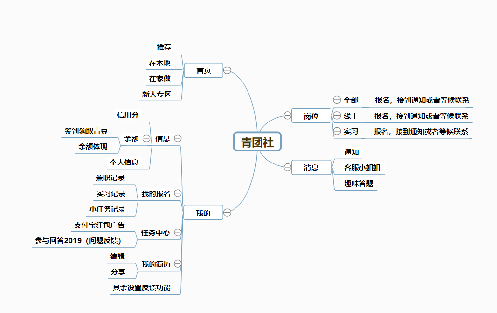

分析：

* 首页与岗位页面功能重叠，功能划分不够合理，略显臃肿
* 新人专区页面广告过多，体验不佳
* 页面内过多嵌套信息，设计不合理
* 加入签到功能以及趣味问答，增加用户对APP黏性以及APP的趣味性
* 信用分机制

#### e兼职

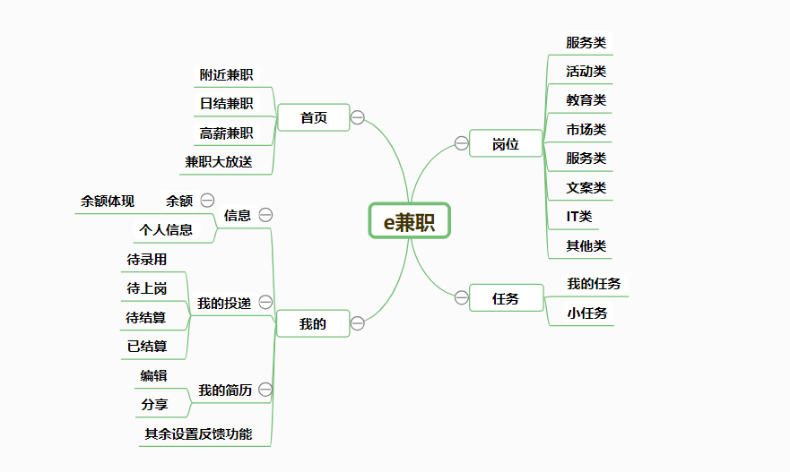

分析

* 任务页面完全没有什么实际功能，有点多余
* 首页与岗位设计的比较好，首页页面主推荐，岗位主岗位的分类，模块合理
* 界面搭配简洁，视觉效果很好，UI设计值得学习，广告较少

#### 兼职猫

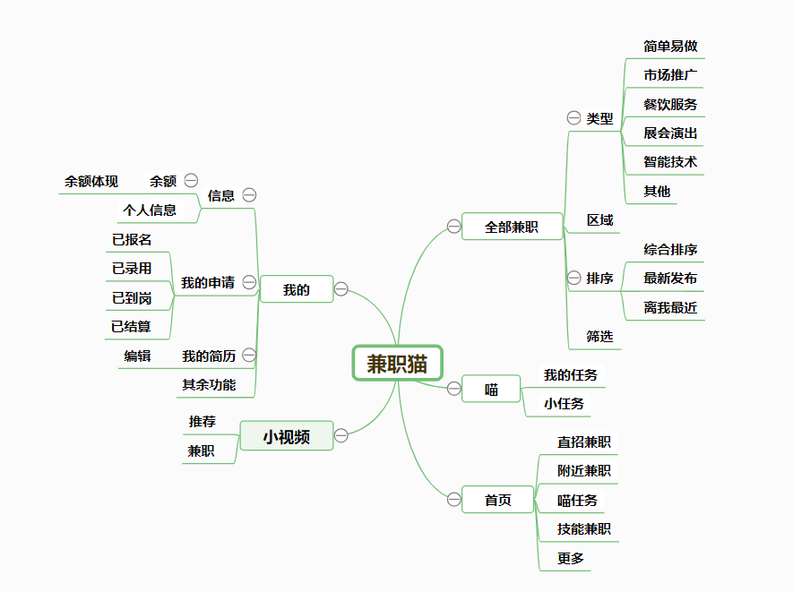

分析

* 功能划分感觉略微模糊
* 提供小视频娱乐功能，个人觉得略显多余
* 收集个人信息以及意愿倾向，提供个性化服务
* 部分功能有点鸡肋

### 交互体验

> **核心流程的界面截图在附录给出**

#### 青团社

* 图标简洁好看

* 页面内广告以及无关信息嵌套过多，影响体验
* 消息页面不错

#### e兼职

* 界面整体整洁，配色舒适
* 架构清晰合理，交互上也比较符合用户习惯

#### 兼职猫

* 体验不是很好，过于倾向个人信息收集
* 页面设计布局不是特别的合理
* 提供的兼职种类众多
* 提供的功能比较多，但是似乎有点用不上

### 亮点特点借鉴

#### 青团社

* 提供较好的反馈功能，有人工客服通道
* 提供签到奖励青豆以及趣味游戏，增加用户粘性和活跃度
* 信用分机制

#### e兼职

* UI设计及交互很好

#### 兼职猫

* 社交功能

## 市场调研

### 调研目的
为了了解用户在使用“挣闲钱”小程序的确切需求，我们根据竞品分析的结果，采用用户访谈的方法，深入了解我们现在认识的机会点是否真的存在以及发现更多的潜在机会点。

### 调研方式
问卷调查

### 调研结果

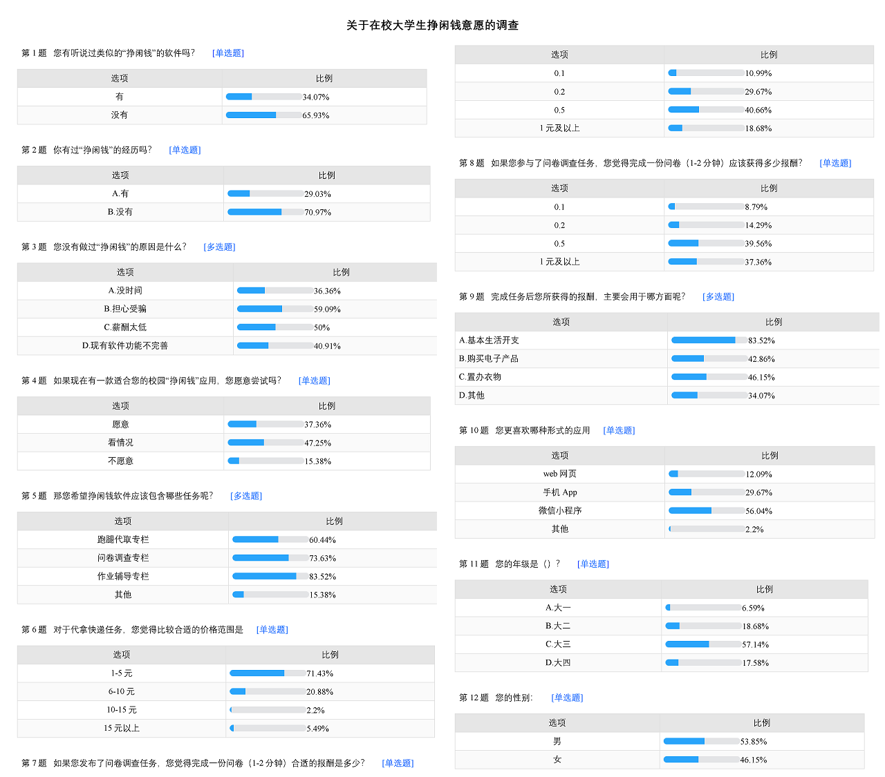

调查结果表明"挣闲钱"系统有一定的发展前景, 用户更倾向于使用微信小程序的客户端。

## 总结

产品UI视觉设计上应当采用和谐的搭配，色调均衡，同时在规划产品的功能相关模块时候应当有所突出以及简单明了，同时避免各个功能模块互相重叠，同时过于复杂繁琐的操作将降低体验效果。针对产品主打对象为大学生，对于产品的具体功能与设计应当更加贴切大学生，并且可以考虑整合高校现有资源，如勤工助学中心等机构的招聘信息，提高产品的竞争力。

## 附录

**青团社**：岗位-报名-报名成功

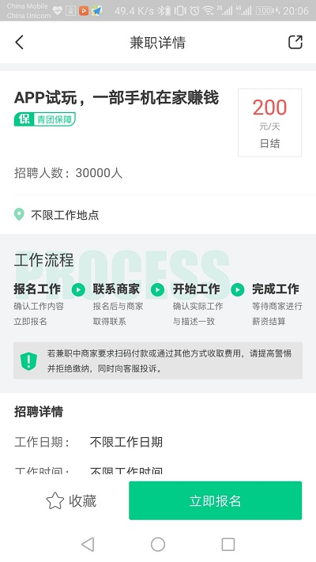

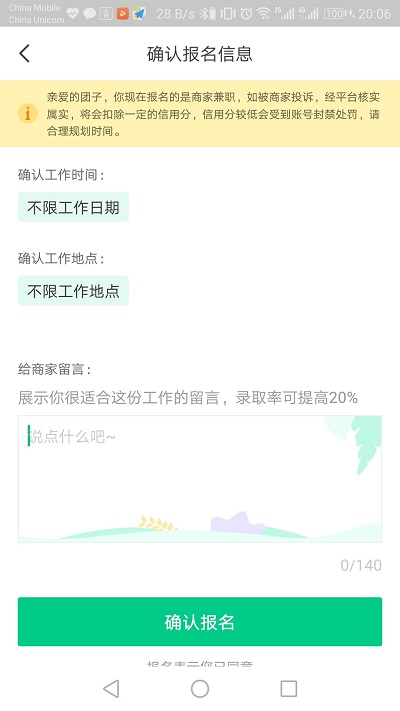

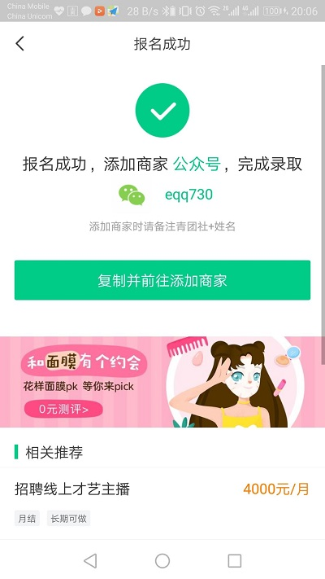

**e兼职**：岗位-报名-报名成功

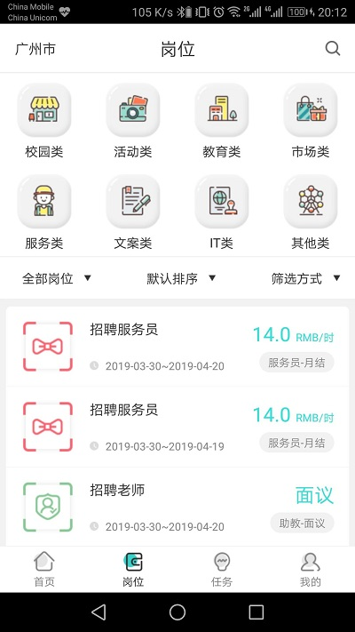

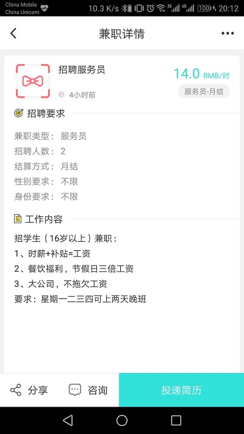

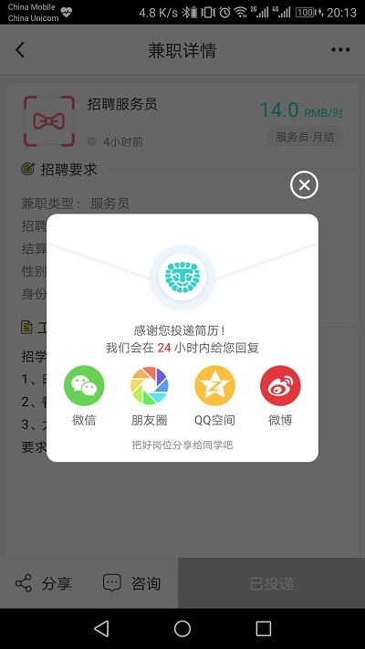

**兼职猫**：全部兼职-报名-报名成功

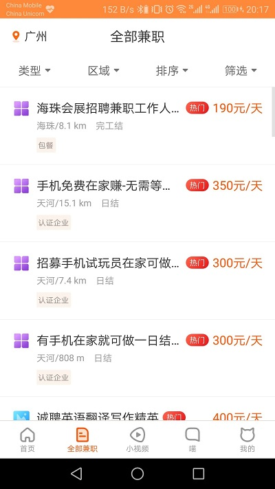

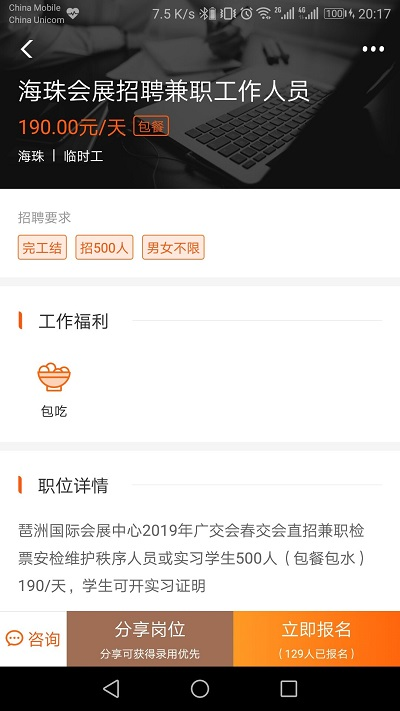

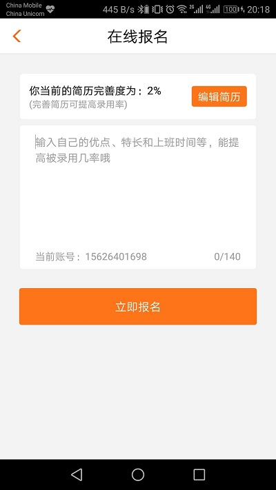

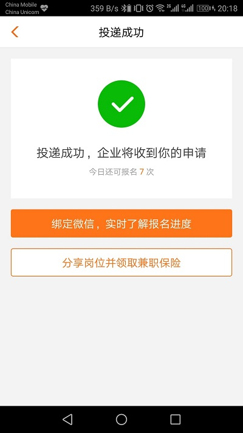