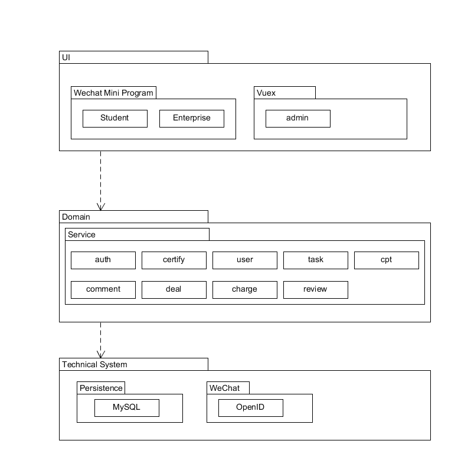
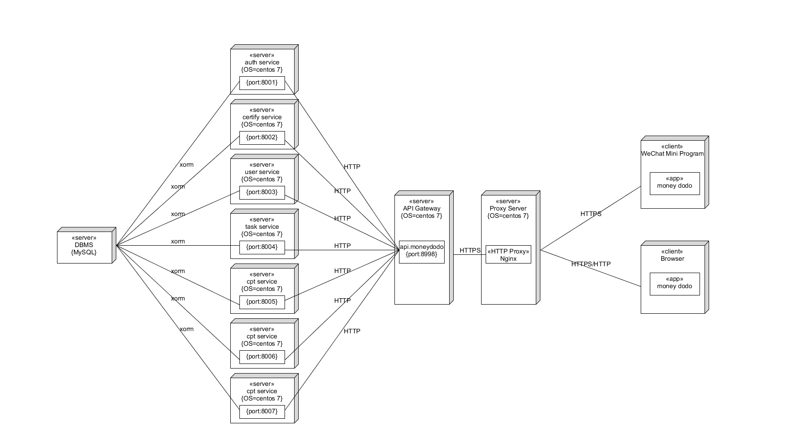

# Software Architecture Document

## 架构问题

### 鉴权

由于一个服务端需要同时服务普通用户端和管理员端，同时又对普通用户划分为高校学生和合作企业，其所拥有的权限各不一样。因此需要对API进行鉴权，管理员相关的API不允许普通用户调用相关的API，同时合作企业端也不允许调用一些高校学生端的API。同时，有部分API需要登陆后才能使用，而部分API则可以直接使用。考虑到这样一个鉴权的需要，需要寻求一个合理的方案。

### 服务器性能

高并发情况下如何保证服务器能够正常提供服务

### 自动测试

考虑到减轻运维的难度，需要在软件架构中考虑并设计自动测试与部署方案。

## 解决方案说明

### 鉴权

本项目基于的是`Go-Kit`微服务架构，使用的是JWT认证模式。对于部分需要登陆和部分不需要登陆的API调用鉴权问题，我们直接在API网关中实现该基础鉴权，通过检查请求是否携带有效的token以及其相关请求是否属于无需鉴权的API来决定是否转发到相应的微服务服务器。对于区分管理员、合作企业、高校学生，则在token中添加角色相关信息，在token中添加一个role的属性，各个微服务在处理请求时，通过解析token获取其中的role属性，从而在相关的请求中进行鉴权和功能实现。

### 可靠性和可支持性

服务器部署在云服务器上，考虑提升服务器的配置，同时服务器采用Docker部署，可以快速部署多个服务器实例。通过服务发现机制，统计所有已启动的服务器实例，并自动配置Nginx进行均衡负载。

### 自动测试

采用Travis CI进行持续的自动测试和部署

## 逻辑视图

## 物理视图

