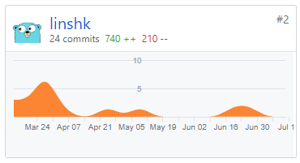
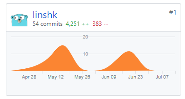

## 个人简单总结

- 小程序开发

  主要作为小程序开发成员，负责小程序部分页面的开发。

- 文档编写

  - 状态模型
  - 代码规范小程序部分
  - 部署指南小程序部分
  - 其他文档

这次项目让我对UP有了一定的认识和感受，特别是UP的不断迭代和灵活性在给开发成员一定的自由度的同时，也降低了项目的风险。通过UP我们能更加容易地适应需求的变化，通过多个迭代逐渐将项目的各项设计引向明确且符合需求的方向。

## PSP 2.1 统计
| PSP 2.1                          | Personal Software Process Stages | Time (%) |
| -------------------------------- | -------------------------------- | -------- |
| Estimate                         | 估计任务时间                     | 5        |
| Analysis                         | 需求分析                         | 5        |
| Design Spec                      | 生成设计文档                     | 5        |
| Coding Standard                  | 代码规范                         | 5        |
| Design Review                    | 设计复审                         | 5        |
| Design                           | 具体设计                         | 10       |
| Coding                           | 具体编码                         | 35       |
| Code Review                      | 代码复审                         | 5        |
| Test                             | 测试                             | 5        |
| Reporting                        | 报告                             | 10       |
| Test Report                      | 测试报告                         | 5        |
| Size measurement                 | 计算工作量                       | 2        |
| Postmortem & Process Improvement | 事后总结与过程改进               | 3        |

## Git 贡献
- Dashboard 文档集合
  

- 微信小程序贡献

## 个人博客清单
1. [微信小程序入门及进阶详细指北](<https://blog.csdn.net/linshk_ver18/article/details/94362062> )

## 特别致谢
队友们都很给力很负责！