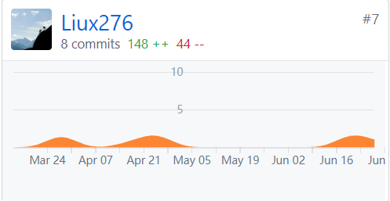
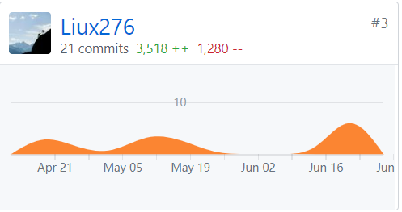

## 个人简单总结
作为团队后台开发成员，负责后端的身份认证模块、任务系统、交易系统的实现，以及完成一些文档的编写等工作。本次后端采用的是go语言开发，主要使用go-kit微服务框架。通过这次的实验，对微服务体系、GO服务端开发、软件开发进度管理有了更深刻的认识。

## PSP 2.1 统计
PSP阶段	耗时(%)

计划	8
- 估计任务时间	8

开发	78
- 分析需求	6
- 生成设计文档	6
- 设计复审	6
- 代码规范	4
- 具体设计	8
- 具体编码	44
- 代码复审	6
- 测试	4

报告	6
- 计算工作量	1
事后总结，提出过程改进计划	5
合计	122
## Git 贡献
- Dashboard 文档集合

- Server 服务端贡献

## 个人博客清单
1. [Go 并发的一些总结](https://segmentfault.com/a/1190000019582694)
2. [JWT Token认证](https://segmentfault.com/a/1190000019582808)
3. [Docker基础学习](https://segmentfault.com/a/1190000019623253)

## 特别致谢
小组各位同学认真参与项目，从讨论到实现都很顺利。