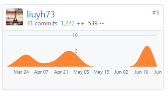
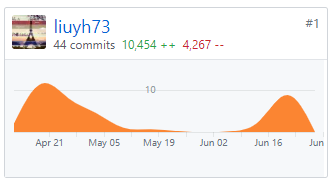

## 个人简单总结

- 架构设计与选择（微服务架构）
  - 在微服务架构中，服务是细粒度的，协议是轻量级的。将应用程序分解成较小服务实现模块化。这使得应用程序更容易理解、开发、测试，架构更有弹性。
  - 小型自治团队能够独立开发、部署和扩展各自的服务，从而实现开发的并行化。
  - 基于微服务的体系结构支持连续交付和部署。

- 后端开发

  主要作为后端开发成员，负责后端的用户系统、充值系统、任务交互系统的实现。

- SwaggerUI

  实现与前端交互的SwaggerUI，展示API有利于前后端交互。

- 文档编写

  - REST API设计
  - 数据库设计
  - 其他文档

在这次项目中，充分认识到了软件开发的整个流程，熟悉了微服务开发，对小程序开发也有了一定的了解，对今后的学习有很大的帮助。

## PSP 2.1 统计
| PSP 2.1                          | Personal Software Process Stages | Time (%) |
| -------------------------------- | -------------------------------- | -------- |
| Estimate                         | 估计任务时间                     | 5        |
| Analysis                         | 需求分析                         | 5        |
| Design Spec                      | 生成设计文档                     | 5        |
| Coding Standard                  | 代码规范                         | 5        |
| Design Review                    | 设计复审                         | 5        |
| Design                           | 具体设计                         | 10       |
| Coding                           | 具体编码                         | 30       |
| Code Review                      | 代码复审                         | 5        |
| Test                             | 测试                             | 10       |
| Reporting                        | 报告                             | 10       |
| Test Report                      | 测试报告                         | 5        |
| Size measurement                 | 计算工作量                       | 2        |
| Postmortem & Process Improvement | 事后总结与过程改进               | 3        |

## Git 贡献
- Dashboard 文档集合
  

- Server 服务端贡献

## 个人博客清单
1. [SwaggerUI初探](https://blog.csdn.net/liuyh73/article/details/89604235)
2. [微服务架构|Go-Kit初探](https://blog.csdn.net/liuyh73/article/details/90049092)
3. [微服务架构|GoKit-CLI使用](https://blog.csdn.net/liuyh73/article/details/90139915)

## 特别致谢
感谢小组中所有成员，大家齐心协力完成这次工作。