# 界面设计
## 小程序端
1. 查看个人信息/完善个人信息界面(未认证)：

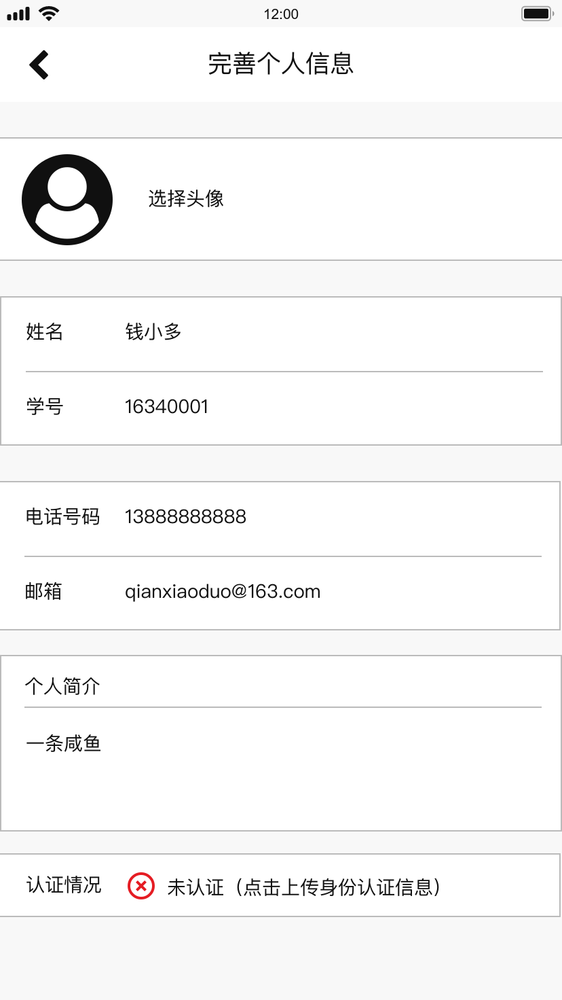

2. 查看个人信息/完善个人信息界面(已认证)：

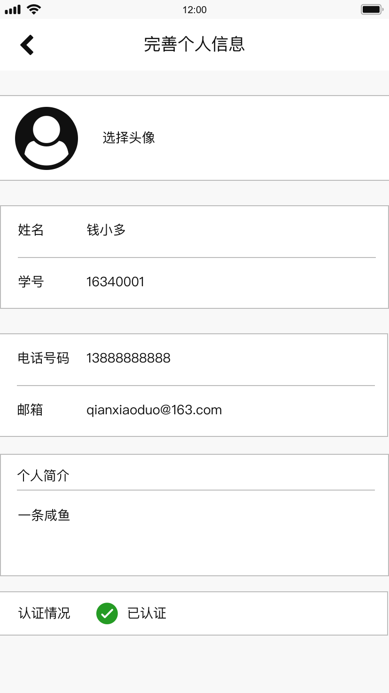

3. 首页：

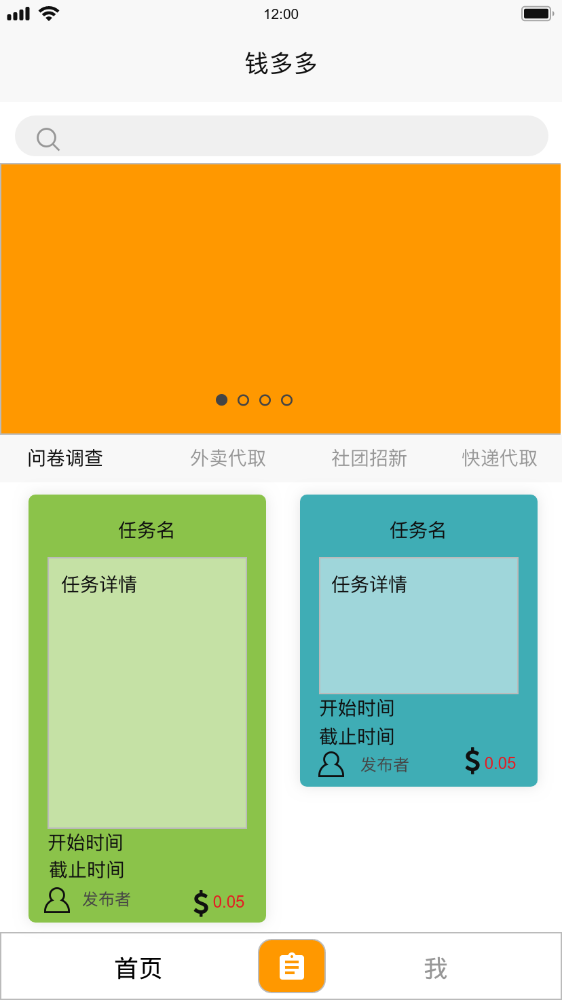

4. 发布任务页：

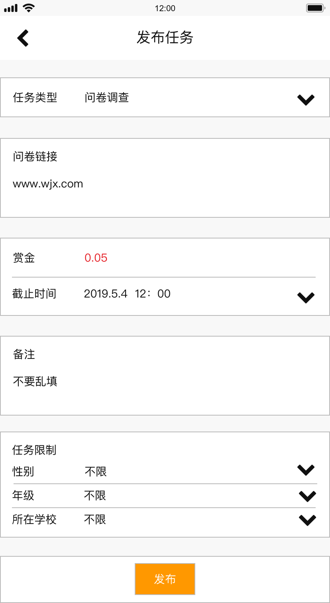

5. 设计/填写问卷页:

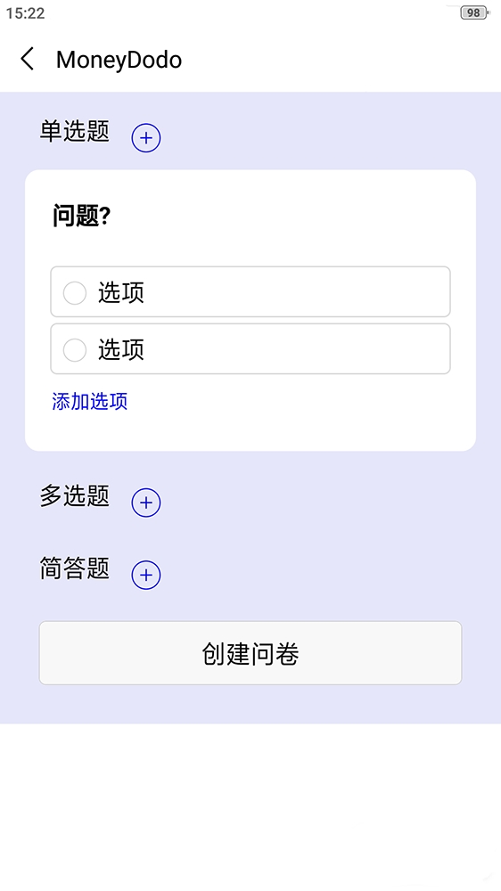

6. 我的页面:

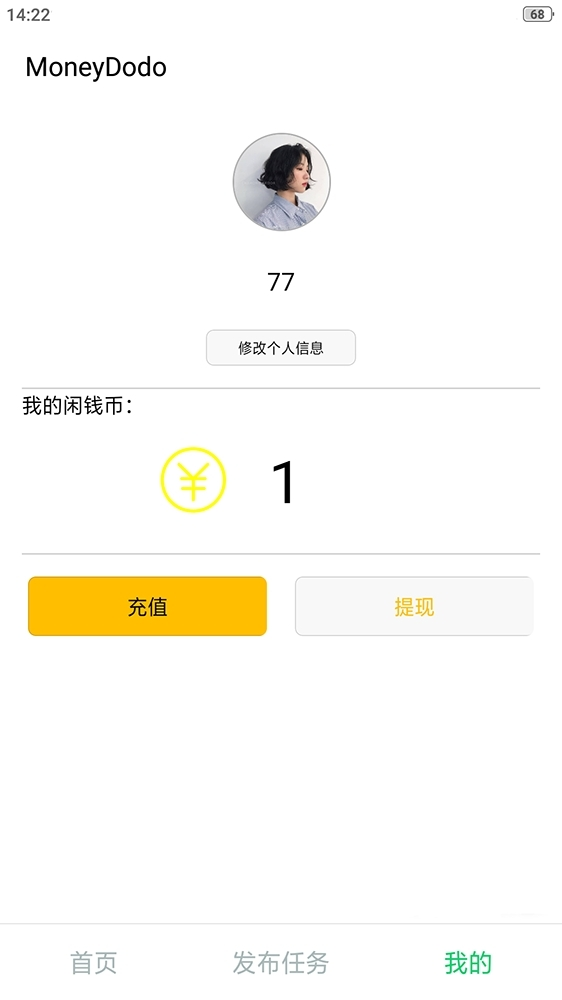

7. 成功提示页：

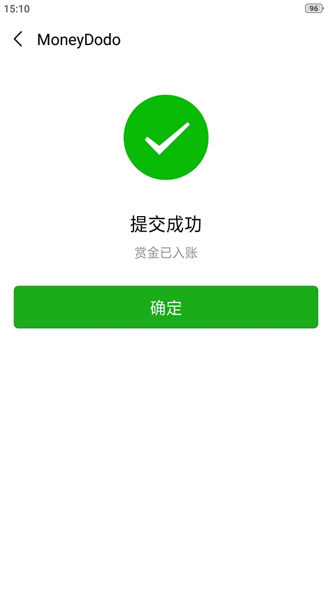

8. 任务详情页：

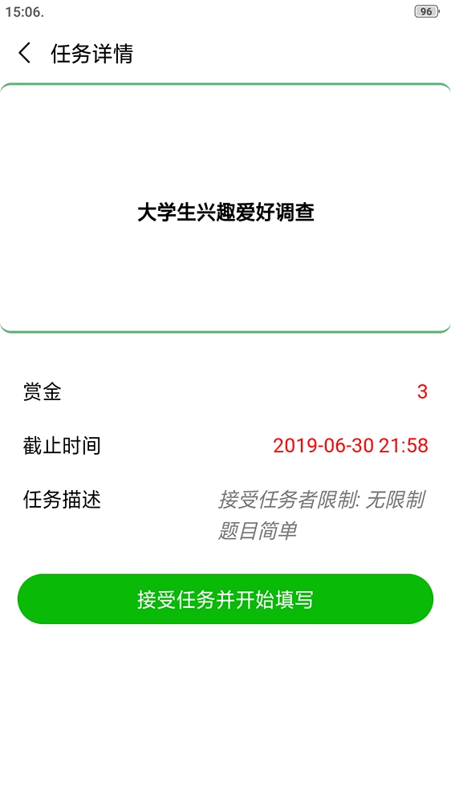

## web端
1. 登录页面

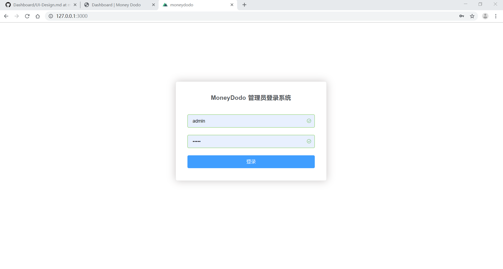

2. 主页面左侧菜单

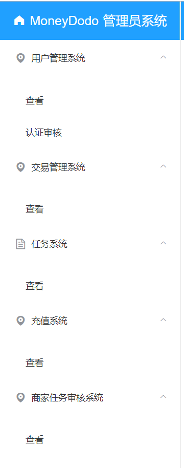

3. 查看注册用户

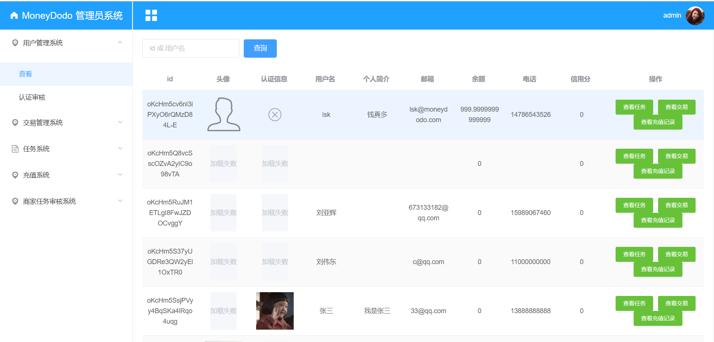

4. 用户认证审核

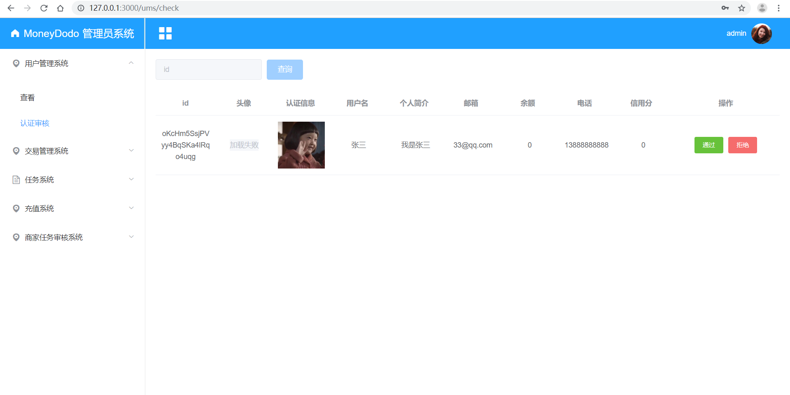

5. 查看任务

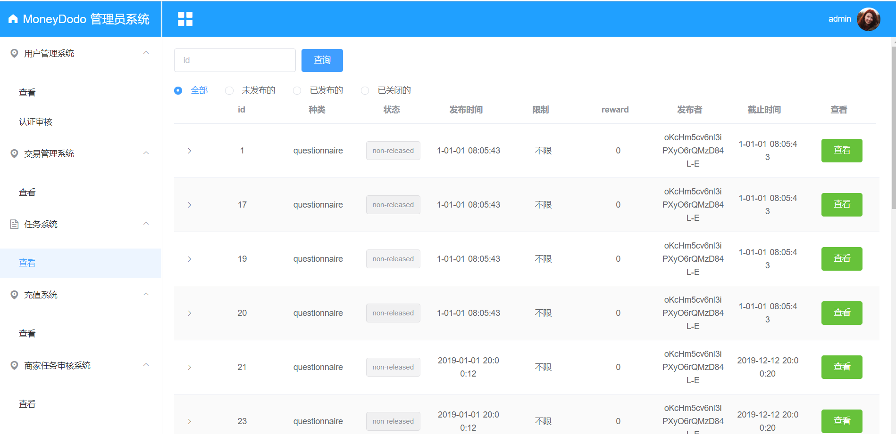

6. 查看任务详情

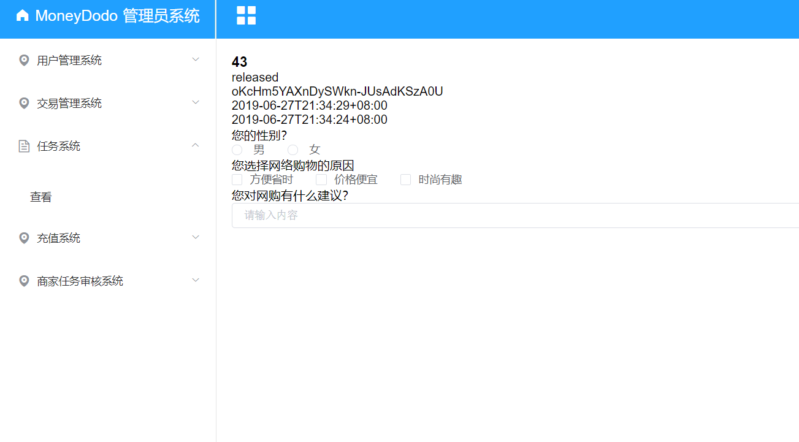

7. 查看充值记录

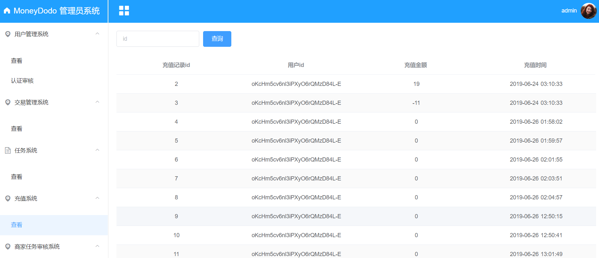

8. 查看所有的记录

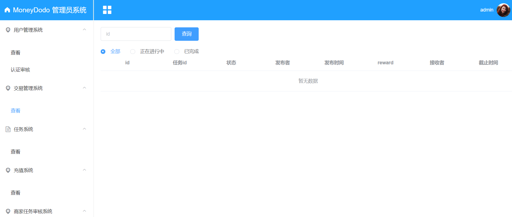

9. 查看商家

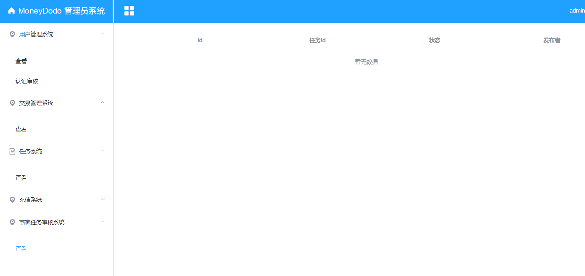