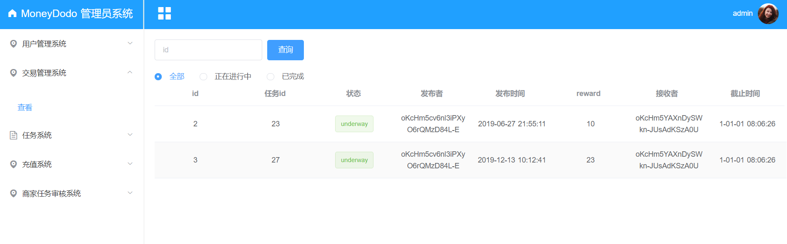
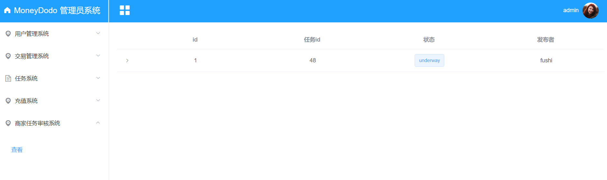

# 界面设计
## 小程序端
1. 查看个人信息/完善个人信息界面(未认证)：

2. 查看个人信息/完善个人信息界面(已认证)：

3. 首页：

4. 发布任务页：

5. 设计/填写问卷页:

6. 我的页面:

7. 成功提示页：

8. 任务详情页：

## web端
1. 登录页面

2. 主页面左侧菜单

3. 查看注册用户

4. 用户认证审核

5. 查看任务

6. 查看任务详情

7. 查看充值记录

8. 查看所有的记录

9. 查看商家

