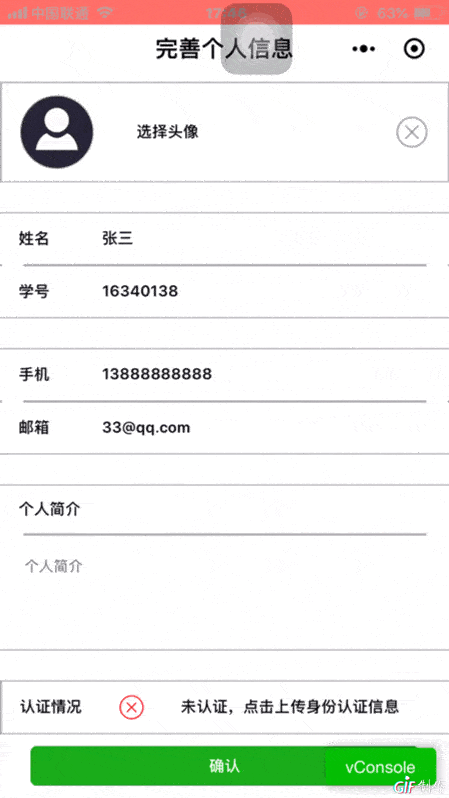

# 小程序效果演示

## 注册用户

- 未注册用户需先完善个人信息，进行注册
- 点击输入框填写相应信息

- 信息填写完成后，上传认证信息，等待后台审核

---

## 界面概览

- 已注册用户直接进入首页
- 首页顶部为推广栏，接下来是任务类型导航栏，然后是指定类型任务的列表
- 可通过底部导航栏切换到创建任务界面或我的个人主页

---

## 修改个人信息

- 从我的个人界面点击按钮进入修改个人信息界面
- 点击编辑按钮即可进行个人信息的修改
- 点击头像上传图片
- 点击信息栏修改相应各人信息
- 点击确认，成功修改个人信息

---

## 接受任务

- 点击任务，查看任务详情
- 点击按钮接受任务，获得问卷
- 填写问卷并提交，成功完成任务，获得赏金

---

## 新建任务

- 点击按钮进入问卷设计界面
- 添加单选题，设置问题与选项

- 可以自定义选项数量
- 添加多选题，设置问题和选项

- 添加简答题，设置问题

- 设置赏金，任务描述，任务限制等基本信息

- 提交任务，成功后即可显示在首页

---

## 充值与提现

- 点击充值按钮，输入充值金额，成功充值闲钱币
- 点击提现按钮，输入提现金额，成功提现闲钱币

---

## 结束任务

- 进入自己发布的任务详情界面，点击结束任务按钮，即可结束任务
- 再次进入任务详情界面，任务状态显示为已结束

